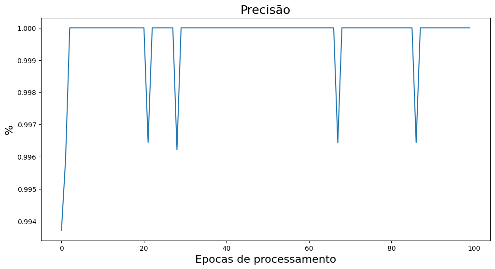
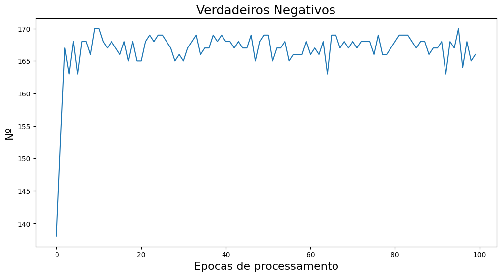
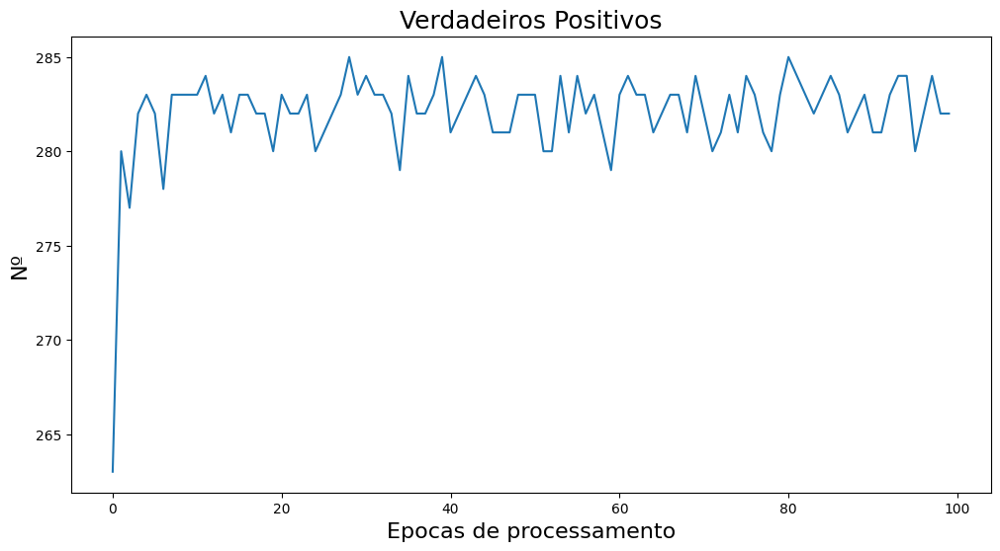
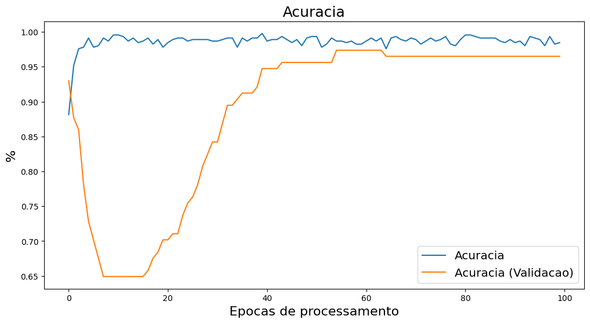
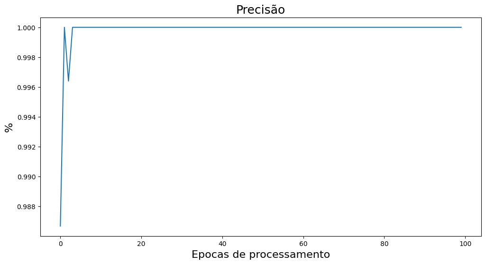
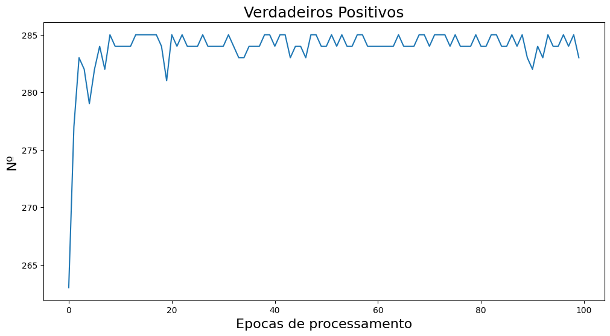
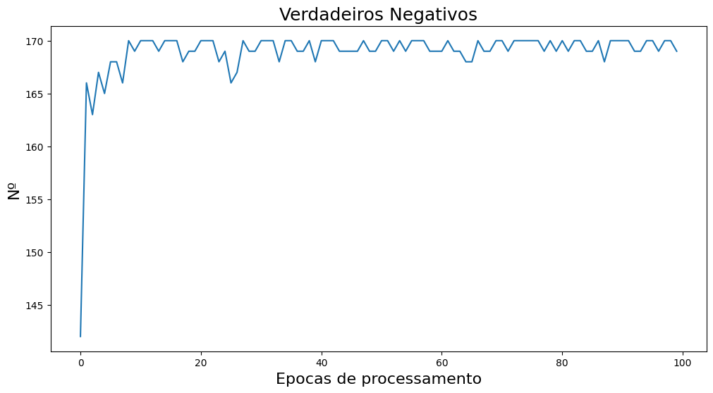
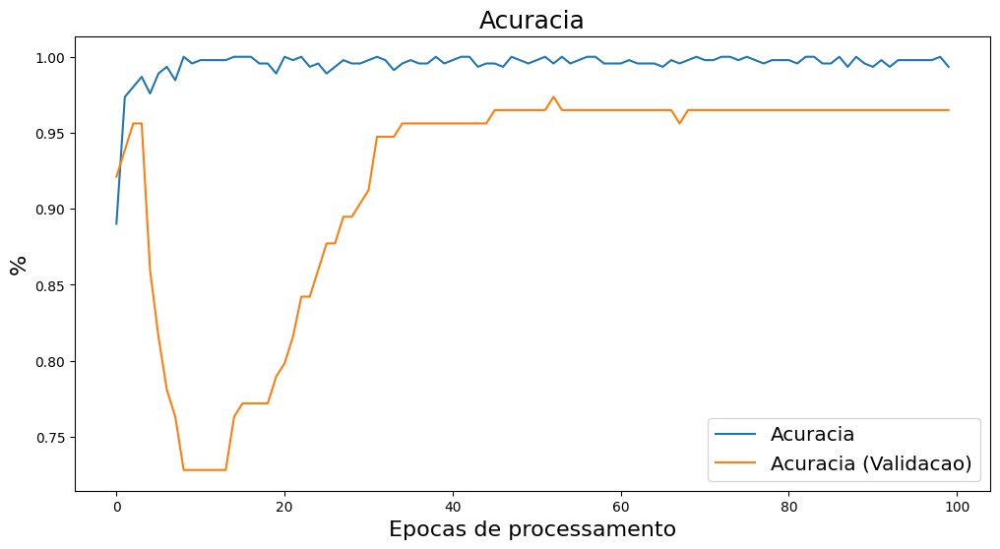

# ML-Breast-Cancer-Diagnosis
Repositório dedicado a um projeto de Machine Learning para identificação de câncer de mama a partir de imagens

# Acompanhamentos dos resultados dos modelos

## Primeira Versão
Baseado em uma primeira versão do modelo classificador binário, ao plotar os gráficos, vê-se uma variação muito alta das métricas definidas para acompanhamento. Por mais que no relatório de métricas, aparentemente os valores são bons, é importante tentar eliminar as variações que aparecem nos gráficos.

#### RELATÓRIO FINAL (MÉTRICAS DE AVALIAÇÃO)  
---------------------------------------  
Acuracia Final: 96.9%  
Acurácia Geral: 97.0%  
Acurácia (Média U10): 97.0%  
Acurácia (Treinamento): 97.0%  
Acurácia (Validação): 98.0%  
Taxa de Perda: 0.05%  
Taxa de Perda (Validação): 0.11%  
Precisão: 100.0%  
Precisão (Validação): 98.0%  
Recall: 99.0%  
Recall (Validação): 95.0%  
F1 Score: 100.0%  
F-Measure: 100.0%  
F1 Score (TP, FP, TN, FN): 97.0%  
Taxa de Aprendizado: 9.999999974752427e-07  
Sensibilidade: 97.0%  
Especificidade: 96.0%  
Acurácia da Matriz de Confusão: 97.0%  
Taxa de Verdadeiros Positivos: 99.0%  
Taxa de Verdadeiros Negativos: 99.0%  
Taxa de Falsos Positivos: 2.0%  
Taxa de Falsos Negativos: 1.0%  
Dados Inválidos: 1.0%  

#### Exemplo do gráfico de algumas das métricas

## Segunda Versão
Após uma tentativa de Fine Turing, foi acrescentado mais camadas de processamento e neurônios, e duas camadas de normalização para tentativa de melhora do modelo.  
Os dados se mantiveram com as métricas parecidas com a da primeira versão, uma variação menor em alguns casos, mas ao plotar os gráficos, percebe-se uma variação ainda alta durante o processo de execução do modelo.

#### RELATÓRIO FINAL (MÉTRICAS DE AVALIAÇÃO)
---------------------------------------
Acuracia Final: 96.46%
Acurácia Geral: 96.0%
Acurácia (Média U10): 96.0%
Acurácia (Treinamento): 96.0%
Acurácia (Validação): 98.0%
Taxa de Perda: 0.03%
Taxa de Perda (Validação): 0.12%
Precisão: 100.0%
Precisão (Validação): 97.0%
Recall: 99.0%
Recall (Validação): 97.0%
F1 Score: 99.0%
F-Measure: 99.0%
F1 Score (TP, FP, TN, FN): 97.0%
Taxa de Aprendizado: 9.999999974752427e-07
Sensibilidade: 97.0%
Especificidade: 96.0%
Acurácia da Matriz de Confusão: 96.0%
Taxa de Verdadeiros Positivos: 99.0%
Taxa de Verdadeiros Negativos: 98.0%
Taxa de Falsos Positivos: 2.0%
Taxa de Falsos Negativos: 1.0%
Dados Inválidos: 1.0%

#### Exemplo do gráfico de algumas das métricas

## Terceira Versão (Final)
Após mais uma tentativa de Fine Turing, deixamos o modelo o mais otimizado, reduzindo um pouco mais sua variação, e variando muito mais perto do seu "modelo perfeito", tornando o modelo mais preciso e seguro.  
Logicamente ainda pode-se perceber variações durante a execução do modelo, e não queremos que ocorra overfitting.

#### RELATÓRIO FINAL (MÉTRICAS DE AVALIAÇÃO)
---------------------------------------
Acuracia Final: 97.34%
Acurácia Geral: 97.0%
Acurácia (Média U10): 97.0%
Acurácia (Treinamento): 97.0%
Acurácia (Validação): 98.0%
Taxa de Perda: 0.02%
Taxa de Perda (Validação): 0.12%
Precisão: 100.0%
Precisão (Validação): 97.0%
Recall: 99.0%
Recall (Validação): 95.0%
F1 Score: 100.0%
F-Measure: 100.0%
F1 Score (TP, FP, TN, FN): 97.0%
Taxa de Aprendizado: 9.999999974752427e-07
Sensibilidade: 97.0%
Especificidade: 97.0%
Acurácia da Matriz de Confusão: 97.0%
Taxa de Verdadeiros Positivos: 100.0%
Taxa de Verdadeiros Negativos: 99.0%
Taxa de Falsos Positivos: 1.0%
Taxa de Falsos Negativos: 1.0%
Dados Inválidos: 0.0%

#### Exemplo do gráfico de algumas das métricas

