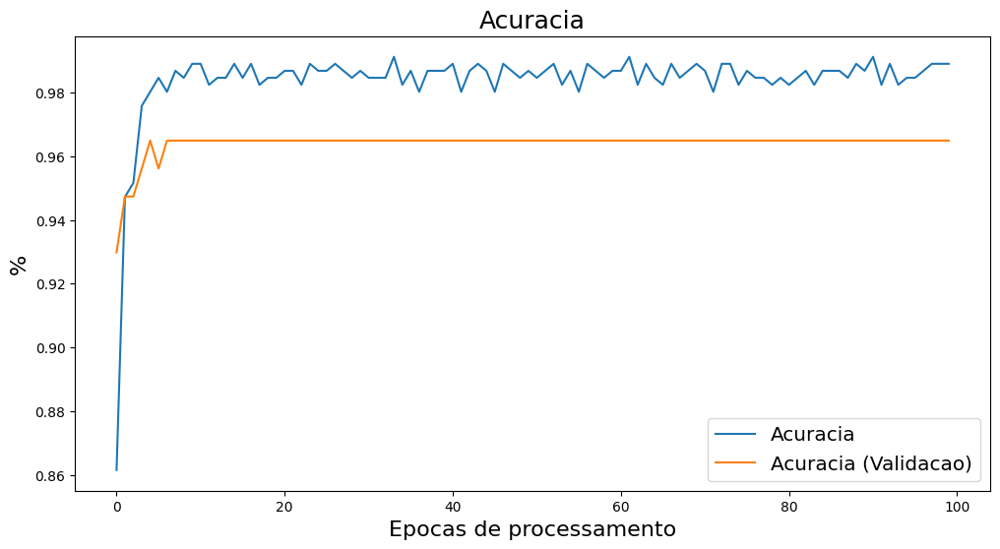
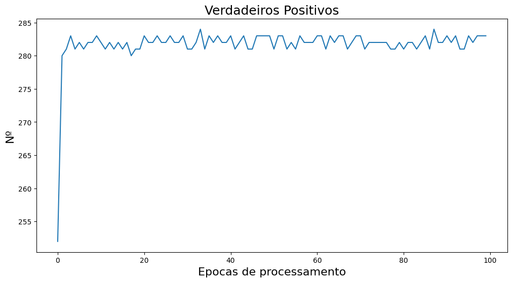
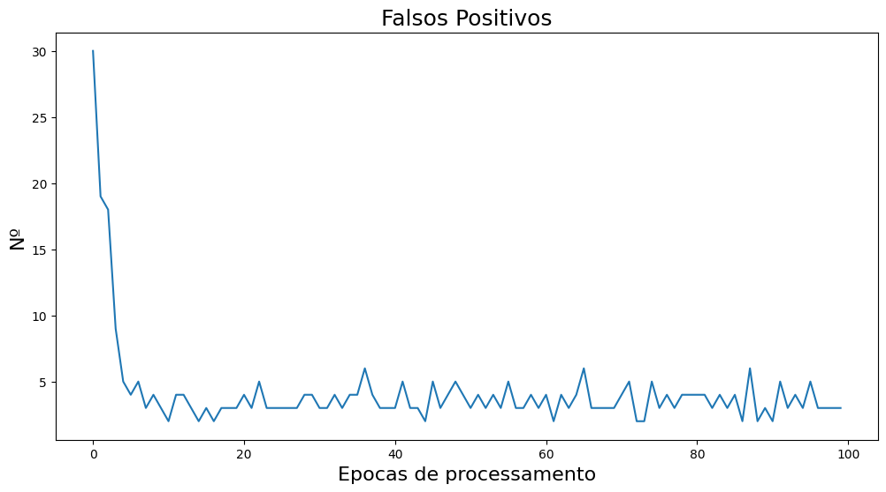

# ML-Breast-Cancer-Diagnosis
Repositório dedicado a um projeto de Machine Learning para identificação de câncer de mama a partir de imagens

# Acompanhamentos dos resultados dos modelos

## Primeira Versão
Baseado em uma primeira versão do modelo classificador binário, ao plotar os gráficos, vê-se uma variação muito alta das métricas definidas para acompanhamento. Por mais que no relatório de métricas, aparentemente os valores são bons, é importante tentar eliminar as variações que aparecem nos gráficos.

#### RELATÓRIO FINAL (MÉTRICAS DE AVALIAÇÃO)  
---------------------------------------  
Acuracia Final: 96.9%  
Acurácia Geral: 97.0%  
Acurácia (Média U10): 97.0%  
Acurácia (Treinamento): 97.0%  
Acurácia (Validação): 98.0%  
Taxa de Perda: 0.05%  
Taxa de Perda (Validação): 0.11%  
Precisão: 100.0%  
Precisão (Validação): 98.0%  
Recall: 99.0%  
Recall (Validação): 95.0%  
F1 Score: 100.0%  
F-Measure: 100.0%  
F1 Score (TP, FP, TN, FN): 97.0%  
Taxa de Aprendizado: 9.999999974752427e-07  
Sensibilidade: 97.0%  
Especificidade: 96.0%  
Acurácia da Matriz de Confusão: 97.0%  
Taxa de Verdadeiros Positivos: 99.0%  
Taxa de Verdadeiros Negativos: 99.0%  
Taxa de Falsos Positivos: 2.0%  
Taxa de Falsos Negativos: 1.0%  
Dados Inválidos: 1.0%  

#### Exemplo do gráfico de algumas das métricas

## Segunda Versão